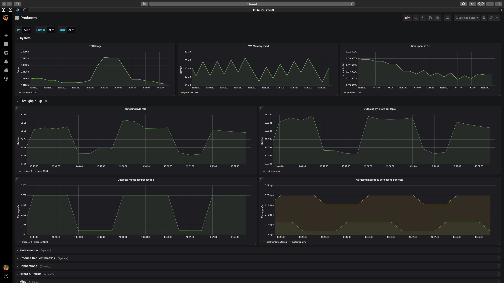
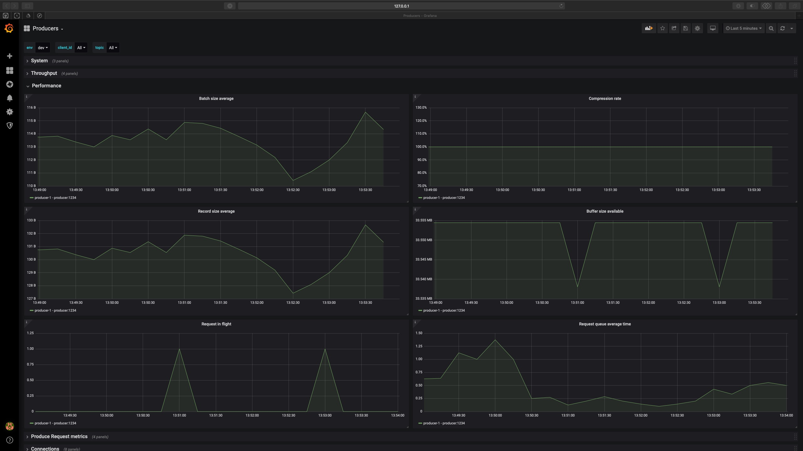
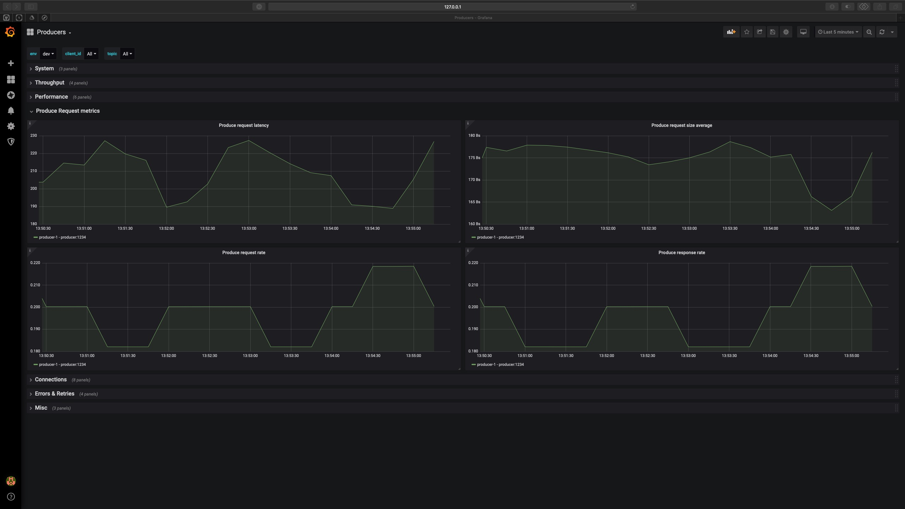
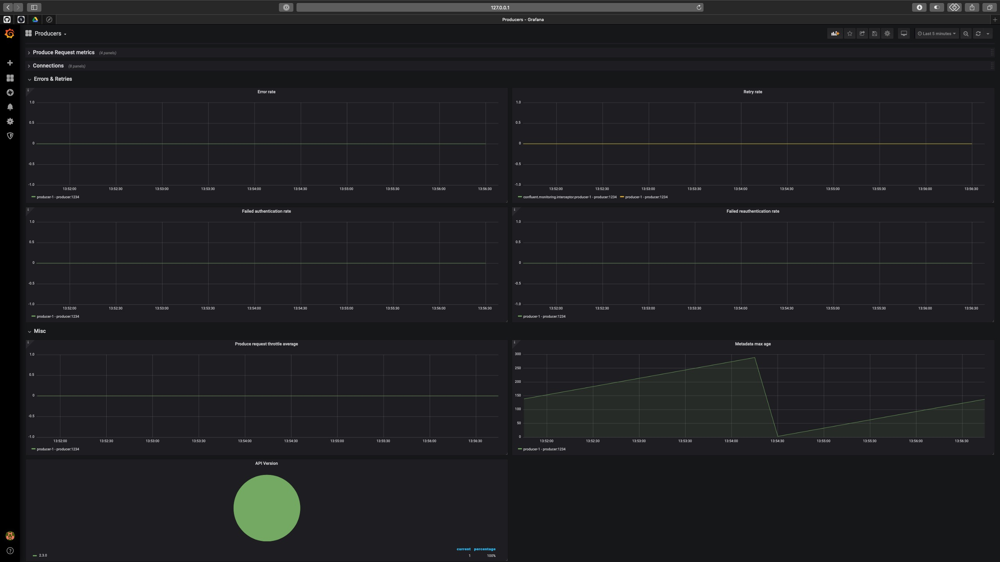
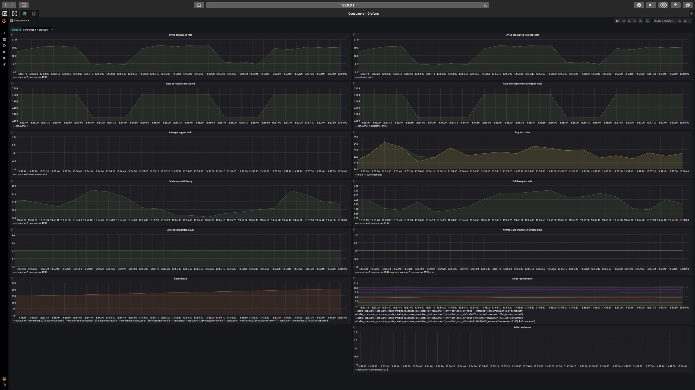
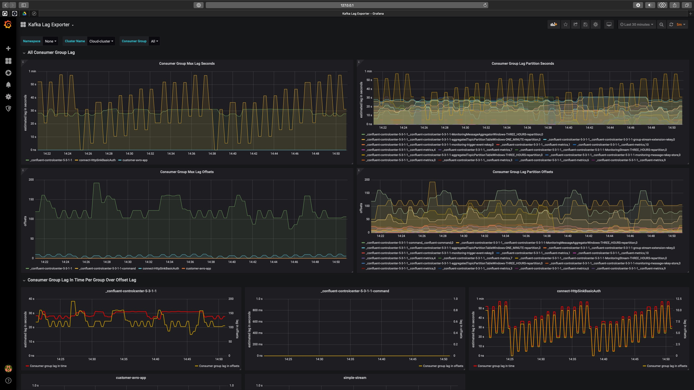
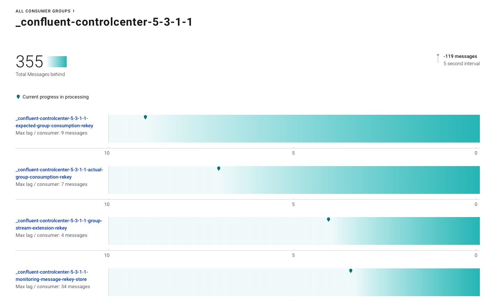
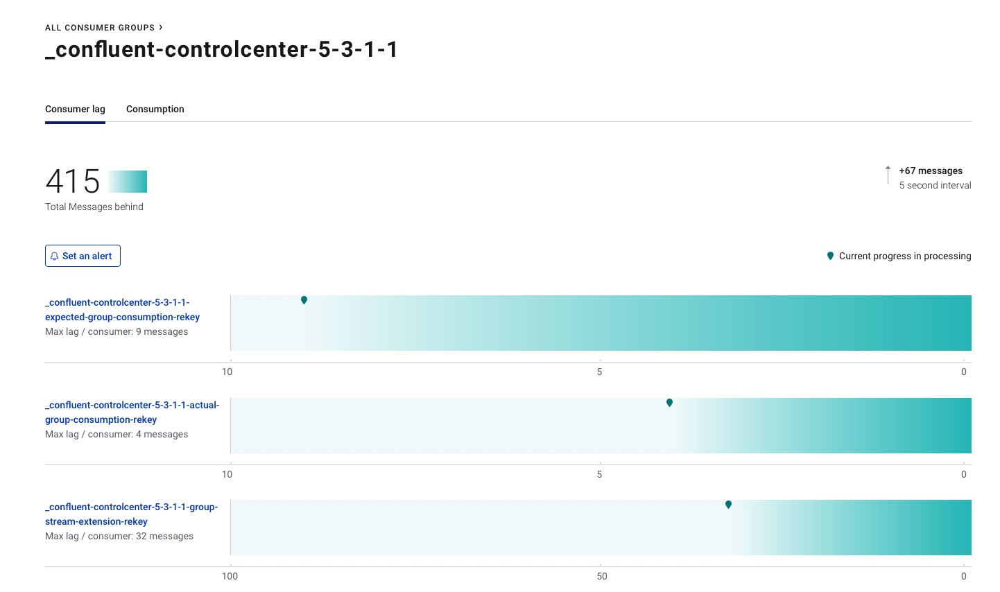

# Confluent Cloud Demo


- [Confluent Cloud Demo](#confluent-cloud-demo)
  - [Disclaimer](#disclaimer)
  - [Pre-requisites](#pre-requisites)
  - [How to run](#how-to-run)
  - [What it does](#what-it-does)
    - [Java Producer](#java-producer)
    - [Kafka Streams](#kafka-streams)
    - [Java Consumer](#java-consumer)
    - [Connect](#connect)
      - [JDBC MySQL Source Connector](#jdbc-mysql-source-connector)
      - [HTTP Sink Connector](#http-sink-connector)
      - [Elasticsearch Sink Connector](#elasticsearch-sink-connector)
    - [Monitoring](#monitoring)
      - [Control Center](#control-center)
      - [Grafana](#grafana)
        - [Producer Dashboard](#producer-dashboard)
        - [Consumer Dashboard](#consumer-dashboard)
        - [Consumer Lag Dashboard](#consumer-lag-dashboard)
      - [How to monitor consumer lag](#how-to-monitor-consumer-lag)
    - [Schema Registry](#schema-registry)
    - [KSQL](#ksql)
    - [REST Proxy](#rest-proxy)
    - [Restrict access to Confluent Cloud](#restrict-access-to-confluent-cloud)
    - [Service Account and ACLs](#service-account-and-acls)
  - [📚 Other useful resources](#%f0%9f%93%9a-other-useful-resources)

## Disclaimer

This demo is for reference purposes only and should be used to see a sample workflow using Confluent Cloud CLI

If you choose to run it against your Confluent Cloud cluster, be aware that it:

- creates and deletes topics, service accounts, API keys, and ACLs
- is for demo purposes only
- should be used only on a non-production cluster

## Pre-requisites

* `docker-compose` (example `brew cask install docker`)
* Local install of the new [Confluent Cloud CLI](https://docs.confluent.io/current/cloud/cli/install.html#ccloud-install-cli) v0.192.0 or above
* [An initialized Confluent Cloud cluster used for development only](https://confluent.cloud)
* [Confluent CLI](https://docs.confluent.io/current/cli/installing.html) installed on your machine, version `v0.128.0` or higher (note: as of CP 5.3, the Confluent CLI is a separate [download](https://docs.confluent.io/current/cli/installing.html)
* `mvn` installed on your host

## How to run

1. Create `$HOME/.ccloud/config`

On the host from which you are running Docker, ensure that you have properly initialized Confluent Cloud CLI and have a valid configuration file at `$HOME/.ccloud/config`.

Example:

```bash
$ cat $HOME/.ccloud/config
bootstrap.servers=<BROKER ENDPOINT>
ssl.endpoint.identification.algorithm=https
security.protocol=SASL_SSL
sasl.mechanism=PLAIN
sasl.jaas.config=org.apache.kafka.common.security.plain.PlainLoginModule required username\="<API KEY>" password\="<API SECRET>";

// Schema Registry specific settings
basic.auth.credentials.source=USER_INFO
schema.registry.basic.auth.user.info=<SR_API_KEY>:<SR_API_SECRET>
schema.registry.url=<SR ENDPOINT>

// license
confluent.license=<YOUR LICENSE>
```

2. (Optional) Enable Confluent Cloud Schema Registry

By default, the demo uses Confluent Schema Registry running in a local Docker container. If you prefer to use Confluent Cloud Schema Registry instead, you need to first set it up:

   a. [Enable](http://docs.confluent.io/current/quickstart/cloud-quickstart.html#step-3-configure-sr-ccloud) Confluent Cloud Schema Registry prior to running the demo

   b. Validate your credentials to Confluent Cloud Schema Registry

   ```bash
   $ curl -u $(grep "^schema.registry.basic.auth.user.info" $HOME/.ccloud/config | cut -d'=' -f2) $(grep "^schema.registry.url" $HOME/.ccloud/config | cut -d'=' -f2)/subjects
   ```

3. Start the demo

Run with local Docker Schema Registry:

```bash
./start.sh
or
./start.sh SCHEMA_REGISTRY_DOCKER
```

Run with Confluent Cloud Schema Registry:

```bash
./start.sh SCHEMA_REGISTRY_CONFLUENT_CLOUD
```

## What it does

### Java Producer

The Java [producer](https://github.com/vdesabou/kafka-docker-playground/blob/master/ccloud-demo/producer/src/main/java/com/github/vdesabou/SimpleProducer.java) (docker service `producer`) is sending messages every 5 seconds to topic `customer-avro` using Avro schema:

```json
{
     "type": "record",
     "namespace": "com.github.vdesabou",
     "name": "Customer",
     "version": "1",
     "fields": [
       { "name": "count", "type": "long", "doc": "count" },
       { "name": "first_name", "type": "string", "doc": "First Name of Customer" },
       { "name": "last_name", "type": "string", "doc": "Last Name of Customer" },
       { "name": "address", "type": "string", "doc": "Address of Customer" }
     ]
}
```

N.B:

- The key is fixed and set with `alice`
- [Interceptors](https://docs.confluent.io/current/control-center/installation/clients.html#java-producers-and-consumers) for Java producer are set

### Kafka Streams

The Kafka Streams [application](https://github.com/vdesabou/kafka-docker-playground/blob/master/ccloud-demo/streams/src/main/java/com/github/vdesabou/SimpleStream.java) (docker service `streams`) called `simple-stream` is listening topic `customer-avro` and is just counting the number of messages received.

N.B:

- [Interceptors](https://docs.confluent.io/current/control-center/installation/clients.html#kstreams) for Kafka Streams are set

### Java Consumer

The Java [consumer](https://github.com/vdesabou/kafka-docker-playground/blob/master/ccloud-demo/consumer/src/main/java/com/github/vdesabou/SimpleConsumer.java) (docker service `consumer`) is listening on topic `customer-avro` and it just printing the records.

N.B:

- [Interceptors](https://docs.confluent.io/current/control-center/installation/clients.html#java-producers-and-consumers) for Java consumer are set


### Connect

A local Connect instance (docker service `connect`) is installed and bootstrapping the Confluent Cloud broker.

N.B:

- [Interceptors](https://docs.confluent.io/current/control-center/installation/clients.html#kconnect-long) for Kafka Connect are set


#### JDBC MySQL Source Connector

A JDBC MySQL source connector called `mysql-source` is created and using a MySQL table called `application`:

Note: the topic `mysql-application` used by this connector shall be created before using command:

```bash
$ ccloud kafka topic create mysql-application --partitions 6
```

```bash
$ docker exec connect \
     curl -X POST \
     -H "Content-Type: application/json" \
     --data '{
               "name": "mysql-source",
               "config": {
                    "connector.class":"io.confluent.connect.jdbc.JdbcSourceConnector",
                    "tasks.max":"1",
                    "connection.url":"jdbc:mysql://mysql:3306/db?user=user&password=password&useSSL=false",
                    "table.whitelist":"application",
                    "mode":"timestamp+incrementing",
                    "timestamp.column.name":"last_modified",
                    "incrementing.column.name":"id",
                    "topic.prefix":"mysql-"
          }}' \
     http://localhost:8083/connectors | jq .
```


We can consume messages from topic `mysql-application` using multiple ways:

* Using `kafka-avro-console-consumer`:

```bash
$ docker-compose exec -e BOOTSTRAP_SERVERS="$BOOTSTRAP_SERVERS" -e SASL_JAAS_CONFIG="$SASL_JAAS_CONFIG" -e BASIC_AUTH_CREDENTIALS_SOURCE="$BASIC_AUTH_CREDENTIALS_SOURCE" -e SCHEMA_REGISTRY_BASIC_AUTH_USER_INFO="$SCHEMA_REGISTRY_BASIC_AUTH_USER_INFO" -e SCHEMA_REGISTRY_URL="$SCHEMA_REGISTRY_URL" connect bash -c 'kafka-avro-console-consumer --topic mysql-application --bootstrap-server $BOOTSTRAP_SERVERS --consumer-property ssl.endpoint.identification.algorithm=https --consumer-property sasl.mechanism=PLAIN --consumer-property security.protocol=SASL_SSL --consumer-property sasl.jaas.config="$SASL_JAAS_CONFIG" --property basic.auth.credentials.source=$BASIC_AUTH_CREDENTIALS_SOURCE --property schema.registry.basic.auth.user.info="$SCHEMA_REGISTRY_BASIC_AUTH_USER_INFO" --property schema.registry.url=$SCHEMA_REGISTRY_URL --from-beginning --max-messages 2'
```

* Using `confluent` cli and Docker Schema Registry:

```bash
$ confluent local consume mysql-application -- --cloud --value-format avro --property schema.registry.url=http://127.0.0.1:8085 --from-beginning --max-messages 2
```

* Using `confluent` cli and Confluent Cloud Schema Registry:

```bash
$ confluent local consume mysql-application -- --cloud --value-format avro --property schema.registry.url=$SCHEMA_REGISTRY_URL --property basic.auth.credentials.source=USER_INFO --property schema.registry.basic.auth.user.info="$SCHEMA_REGISTRY_BASIC_AUTH_USER_INFO" --from-beginning --max-messages 2
```

Results:

```json
{"id":1,"name":"kafka","team_email":"kafka@apache.org","last_modified":1573054234000}
{"id":2,"name":"another","team_email":"another@apache.org","last_modified":1573054378000}
```

#### HTTP Sink Connector

An HTTP sink connector called `http-sink` is created and listening on topic `mysql-application`:

```bash
$ docker exec -e BOOTSTRAP_SERVERS="$BOOTSTRAP_SERVERS" -e CLOUD_KEY="$CLOUD_KEY" -e CLOUD_SECRET="$CLOUD_SECRET" connect \
     curl -X POST \
     -H "Content-Type: application/json" \
     --data '{
          "name": "http-sink",
          "config": {
               "topics": "mysql-application",
               "tasks.max": "1",
               "connector.class": "io.confluent.connect.http.HttpSinkConnector",
               "key.converter": "org.apache.kafka.connect.storage.StringConverter",
               "value.converter": "org.apache.kafka.connect.storage.StringConverter",
               "confluent.topic.ssl.endpoint.identification.algorithm" : "https",
               "confluent.topic.sasl.mechanism" : "PLAIN",
               "confluent.topic.request.timeout.ms" : "20000",
               "confluent.topic.bootstrap.servers": "'"$BOOTSTRAP_SERVERS"'",
               "retry.backoff.ms" : "500",
               "confluent.topic.sasl.jaas.config" : "org.apache.kafka.common.security.plain.PlainLoginModule required username=\"'$CLOUD_KEY'\" password=\"'$CLOUD_SECRET'\";",
               "confluent.topic.security.protocol" : "SASL_SSL",
               "confluent.topic.replication.factor": "1",
               "http.api.url": "http://http-service-basic-auth:8080/api/messages",
               "auth.type": "BASIC",
               "connection.user": "admin",
               "connection.password": "password"
          }}' \
     http://localhost:8083/connectors | jq .
```


Messages are published on HTTP server listening on port `8080`

```bash
$ curl admin:password@localhost:9080/api/messages | jq .
```

Example:

```json
[
  {
    "id": 1,
    "message": "\u0000\u0000\u0000\u0000\u0002\u0002\nkafka kafka@apache.org?????["
  },
  {
    "id": 2,
    "message": "\u0000\u0000\u0000\u0000\u0002\u0004\u000eanother$another@apache.org?????["
  }
]
```

#### Elasticsearch Sink Connector

An Elasticsearch sink connector called `elasticsearch-sink` is created and listening on topic `mysql-application`:

```bash
$ docker exec connect \
     curl -X POST \
     -H "Content-Type: application/json" \
     --data '{
        "name": "elasticsearch-sink",
        "config": {
          "connector.class": "io.confluent.connect.elasticsearch.ElasticsearchSinkConnector",
          "tasks.max": "1",
          "topics": "mysql-application",
          "key.ignore": "true",
          "connection.url": "http://elasticsearch:9200",
          "type.name": "kafka-connect",
          "name": "elasticsearch-sink"
          }}' \
     http://localhost:8083/connectors | jq .
```

We check that the data is available in Elasticsearch using:

```bash
$ curl -XGET 'http://localhost:9200/mysql-application/_search?pretty'
```

Result:

```json
{
  "took" : 296,
  "timed_out" : false,
  "_shards" : {
    "total" : 5,
    "successful" : 5,
    "skipped" : 0,
    "failed" : 0
  },
  "hits" : {
    "total" : 2,
    "max_score" : 1.0,
    "hits" : [
      {
        "_index" : "mysql-application",
        "_type" : "kafka-connect",
        "_id" : "mysql-application+3+0",
        "_score" : 1.0,
        "_source" : {
          "id" : 2,
          "name" : "another",
          "team_email" : "another@apache.org",
          "last_modified" : 1574932446000
        }
      },
      {
        "_index" : "mysql-application",
        "_type" : "kafka-connect",
        "_id" : "mysql-application+4+0",
        "_score" : 1.0,
        "_source" : {
          "id" : 1,
          "name" : "kafka",
          "team_email" : "kafka@apache.org",
          "last_modified" : 1574932363000
        }
      }
    ]
  }
}
```

### Monitoring

#### Control Center

A local Control Center instance (docker service `control-center`) is installed and reachable at [http://127.0.0.1:9021](http://127.0.0.1:9021]).

* Screenshots

See the [differences between Confluent Cloud UI and local Control Center connected to Confluent Cloud](./ccloud_control_center_comparison)

* Alerts

You can setup [alerts](https://docs.confluent.io/current/control-center/alerts/index.html) in Control Center.
Here is a table indicating which triggers are available when Control Center is connected to a Confluent Cloud cluster:

Note: All Broker, Cluster and Topic triggers are not available because Confluent Cloud [does not expose](https://docs.confluent.io/current/cloud/connect/c3-cloud-config.html#limitations) those metrics.

|  Component type | Criteria  | Available | Appear in History
|---|---|---|---|
|  Broker  | Bytes in  | no  |   |
|  Broker  | Bytes out  | no  |   |
|  Broker  | Fetch request latency  | no  |   |
|  Broker  | Production request count | no  |   |
|  Broker  | Production request latency  | no  |   |
|  Cluster  | Active Controller count  | no  |   |
|  Cluster  | Cluster down  | no  |   |
|  Cluster  | Leader election rate | no  |   |
|  Cluster  | Offline topic partitions | no  |   |
|  Cluster  | Unclean election count  | no  |   |
|  Cluster  | Under replicated topic partitions  | no  |   |
|  Cluster  | ZK Disconnected  | no  |   |
|  Cluster  | Zookeeper expiration rate  | no  |   |
|  Consumer group  | Average latency (ms)  | yes  | yes  |
|  Consumer group  | Consumer lag  | yes  |  no * |
|  Consumer group  | Consumer lead | yes  | yes  |
|  Consumer group  | Consumption difference  | yes  |  yes |
|  Consumer group  | Maximum latency (ms)  | yes  |  yes |
|  Topic  | Bytes in  | no  |   |
|  Topic  | Bytes out  | no  |   |
|  Topic  | Out of sync replica count | no  |   |
|  Topic  | Production request count | no  |   |
|  Topic  | Under replicated topic partitions  | no  |   |

\* Expected, as per the [docs](https://docs.confluent.io/current/control-center/alerts/navigate.html#alerts-history):

```
Any alerts triggered by consumer lag, cluster status, or broker status events do not populate history. Alert emails sent do not contain an email link to alerts history.
```

#### Grafana

[JMX Exporter](https://github.com/prometheus/jmx_exporter), [Prometheus](https://github.com/prometheus/prometheus) and [Grafana](https://grafana.com) are installed in order to provide a demo of clients monitoring.

Open a brower and visit http://127.0.0.1:3000 (login/password is `admin/admin`)

You should see 3 dashboards:

##### Producer Dashboard












##### Consumer Dashboard



##### Consumer Lag Dashboard

This demo is using [kafka-lag-exporter](https://github.com/lightbend/kafka-lag-exporter) in order to pull consumer lags metrics from Confluent Cloud cluster and be exported to Prometheus.




#### How to monitor consumer lag

You have several ways to monitor consumer lag:

1. [Monitor Consumer Lag via the Confluent Cloud Interface](https://docs.confluent.io/current/cloud/using/monitor-lag.html#monitor-consumer-lag-via-the-ccloud-interface)



Note: if the cluster is [VPC peered](https://docs.confluent.io/current/cloud/vpc.html), you need to follow [Configuring Access to the UI Dashboard](https://docs.confluent.io/current/cloud/vpc.html#configuring-access-to-the-ui-dashboard) in order to have access to consumer interface.

2. Monitor Consumer Lag via Control Center connected to your Confluent Cloud cluster

If you have a Control Center connected to your Confluent Cloud cluster, as explained [above](#control-center), then you can see consumer lag:



3. [Monitor Offset Lag via Java Client Metrics](https://docs.confluent.io/current/cloud/using/monitor-lag.html#monitor-offset-lag-via-java-client-metrics)

This requires to monitor JMX metric `records-lag-max`from your Java consumer

4. Using kafka-consumer-groups CLI for Confluent Cloud

You need to create a file like this:

Example:

```
$ cat client.properties

ssl.endpoint.identification.algorithm=https
sasl.mechanism=PLAIN
request.timeout.ms=20000
retry.backoff.ms=500
sasl.jaas.config=org.apache.kafka.common.security.plain.PlainLoginModulerequired username="<API_KEY>" password="<API_SECRET>";
security.protocol=SASL_SSL
```

Then you can call `kafka-consumer-groups` command:

```bash
./kafka-consumer-groups --bootstrap-server ${BOOTSTRAP_SERVERS} --command-config /path/to/your/client.properties --list
```

```bash
./kafka-consumer-groups --bootstrap-server ${BOOTSTRAP_SERVERS} --command-config /path/to/your/client.properties --group <your consumer group> --describe
```

Example:

```bash
$ kafka-consumer-groups --bootstrap-server $BOOTSTRAP_SERVERS --command-config /tmp/client.properties --list

_confluent-controlcenter-5-3-1-1
customer-avro-app
connect-http-sink
simple-stream
_confluent-controlcenter-5-4-0-1
_confluent-controlcenter-5-4-0-1-command
_confluent-controlcenter-5-3-1-1-command
```

```bash
$ kafka-consumer-groups --bootstrap-server $BOOTSTRAP_SERVERS --command-config /tmp/client.properties --group customer-avro-app --describe

GROUP             TOPIC           PARTITION  CURRENT-OFFSET  LOG-END-OFFSET  LAG             CONSUMER-ID                                     HOST                                      CLIENT-ID
customer-avro-app customer-avro   2          0               0               0               consumer-1-c0b84633-8bdf-452c-ab69-387726e4234b 152.227.102.84.rev.sfr.net/84.102.227.152 consumer-1
customer-avro-app customer-avro   3          1366            1366            0               consumer-1-c0b84633-8bdf-452c-ab69-387726e4234b 152.227.102.84.rev.sfr.net/84.102.227.152 consumer-1
customer-avro-app customer-avro   1          0               0               0               consumer-1-c0b84633-8bdf-452c-ab69-387726e4234b 152.227.102.84.rev.sfr.net/84.102.227.152 consumer-1
customer-avro-app customer-avro   5          0               0               0               consumer-1-c0b84633-8bdf-452c-ab69-387726e4234b 152.227.102.84.rev.sfr.net/84.102.227.152 consumer-1
customer-avro-app customer-avro   0          0               0               0               consumer-1-c0b84633-8bdf-452c-ab69-387726e4234b 152.227.102.84.rev.sfr.net/84.102.227.152 consumer-1
customer-avro-app customer-avro   4          0               0               0               consumer-1-c0b84633-8bdf-452c-ab69-387726e4234b 152.227.102.84.rev.sfr.net/84.102.227.152 consumer-1
```

Note: for Confluent customers, you can refer to this Knowledge Base [article](https://support.confluent.io/hc/en-us/articles/360022562212-kafka-consumer-groups-command-for-Confluent-Cloud)

5. Using [kafka-lag-exporter](https://github.com/lightbend/kafka-lag-exporter) and Prometheus

This is explained [above](#consumer-lag-dashboard).

### Schema Registry

A local Schema Registry instance (docker service `schema-registry`) is installed and bootstrapping the Confluent Cloud broker.

You can either use it (by running `./start.sh`or `./start.sh SCHEMA_REGISTRY_DOCKER`) or use Confluent Cloud Schema Registry (by running `./start.sh SCHEMA_REGISTRY_CONFLUENT_CLOUD`).

### KSQL

As [Confluent Cloud KSQL](https://docs.confluent.io/current/cloud/limits.html#ccloud-ksql-preview) is still in preview, you can instead install local KSQL instance (docker service `ksql-server`) which is bootstrapping the Confluent Cloud broker.

You can access KSQL CLI using this command:

```bash
$ docker exec -i ksql-cli bash -c 'echo -e "\n\n⏳ Waiting for KSQL to be available before launching CLI\n"; while [ $(curl -s -o /dev/null -w %{http_code} http://ksql-server:8089/) -eq 000 ] ; do echo -e $(date) "KSQL Server HTTP state: " $(curl -s -o /dev/null -w %{http_code} http:/ksql-server:8089/) " (waiting for 200)" ; sleep 5 ; done; ksql http://ksql-server:8089'
```

Example:

```
ksql> show topics;

 Kafka Topic                                                                                   | Registered | Partitions | Partition Replicas | Consumers | ConsumerGroups
---------------------------------------------------------------------------------------------------------------------------------------------------------------------------
 _confluent-monitoring                                                                         | false      | 1          | 3                  | 1         | 1
 _schemas                                                                                      | false      | 1          | 3                  | 0         | 0
 connect-configs                                                                               | false      | 1          | 3                  | 0         | 0
 connect-offsets                                                                               | false      | 25         | 3                  | 0         | 0
 connect-status                                                                                | false      | 5          | 3                  | 0         | 0
 customer-avro                                                                                 | false      | 6          | 3                  | 18        | 3
 simple-stream-KSTREAM-REDUCE-STATE-STORE-0000000003-changelog                                 | false      | 6          | 3                  | 0         | 0
 simple-stream-KSTREAM-REDUCE-STATE-STORE-0000000003-repartition                               | false      | 6          | 3                  | 6         | 1
---------------------------------------------------------------------------------------------------------------------------------------------------------------------------
```

### REST Proxy

A local REST Proxy instance (docker service `rest-proxy`) is installed and reachable on port `8082`.

Make REST calls using `v2` of the REST API (e.g. `application/vnd.kafka.v2+json`) because `v2` has no ZooKeeper dependency. Using `v1` of the API (e.g. `application/vnd.kafka.v1+json`) will not work because v1 has a ZooKeeper dependency that does not work with Confluent Cloud.

Examples:

```bash
$ curl "http://localhost:8082/topics/customer-avro"
```

```json
{
    "configs": {
        "cleanup.policy": "delete",
        "compression.type": "producer",
        "delete.retention.ms": "86400000",
        "file.delete.delay.ms": "60000",
        "flush.messages": "9223372036854775807",
        "flush.ms": "9223372036854775807",
        "follower.replication.throttled.replicas": "",
        "index.interval.bytes": "4096",
        "leader.replication.throttled.replicas": "",
        "max.compaction.lag.ms": "9223372036854775807",
        "max.message.bytes": "2097164",
        "message.downconversion.enable": "true",
        "message.format.version": "2.1-IV2",
        "message.timestamp.difference.max.ms": "9223372036854775807",
        "message.timestamp.type": "CreateTime",
        "min.cleanable.dirty.ratio": "0.5",
        "min.compaction.lag.ms": "0",
        "min.insync.replicas": "2",
        "preallocate": "false",
        "retention.bytes": "-1",
        "retention.ms": "604800000",
        "segment.bytes": "1073741824",
        "segment.index.bytes": "10485760",
        "segment.jitter.ms": "0",
        "segment.ms": "604800000",
        "unclean.leader.election.enable": "false"
    },
    "name": "customer-avro"
}
```

Get broker ids:

```bash
$ curl "http://localhost:8082/brokers"
```

Result:

```json
{"brokers":[0,5,2,8,4,1,6,7,3]}
```

### Restrict access to Confluent Cloud

Things to know:

* Anyone with access to Confluent Cloud web browser (i.e having a login/password) has full access to all the resources (i.e. a SuperUser).

* If you want to [restrict access](https://docs.confluent.io/current/cloud/access-management/restrict-access.html#restrict-access-to-ccloud) to a user, a superuser can provide an API key/secret pair.

  * Either by creating API key/secret using UI, in `Cluster settings->API access` 

  * Or by using `ccloud` CLI (you need to be logged to use the CLI, hence being a superuser)

       ```bash
       ccloud api-key create --resource <cluster id>
       ```

Then a *restricted* user (i.e with no login/password but with API key) will be able to use Confluent Platform commands like kafka-topics, kafka-console-producer, kafka-console-consumer, kafka-consumer-groups, etc..

Follow this [link](https://docs.confluent.io/current/cloud/access-management/restrict-access.html#restrict-access-to-ccloud) for examples

Note that a *restricted* user, even if he's not a superuser, will still be able to create, read, delete topics.

If you want to restrict this, then you need to setup ACLs.


### Service Account and ACLs

You can setup ACLs by using [Service Accounts](https://docs.confluent.io/current/cloud/access-management/service-account.html#service-accounts).
This is done by a *superuser* using `ccloud`cli:

* Create a new service account:

```bash
$ ccloud service-account create demo-app-24353 --description demo-app-24353
+-------------+----------------+
| Id          |          21280 |
| Name        | demo-app-24353 |
| Description | demo-app-24353 |
+-------------+----------------+
```

* Create an API key and secret for the new service account:

```bash
$ ccloud api-key create --service-account-id 21280 --resource lkc-q223m
Save the API key and secret. The secret is not retrievable later.
+---------+------------------------------------------------------------------+
| API Key | <API_KEY_SA>                                                 |
| Secret  | <API_SECRET_SA>                                              |
+---------+------------------------------------------------------------------+
```

Note: wait 90 seconds for the user and service account key and secret to propagate

* Create a local configuration file `/tmp/client.config` for the client to connect to Confluent Cloud with the newly created API key and secret

```
ssl.endpoint.identification.algorithm=https
sasl.mechanism=PLAIN
security.protocol=SASL_SSL
bootstrap.servers=<BOOTSTRAP_SERVERS>
sasl.jaas.config=org.apache.kafka.common.security.plain.PlainLoginModule required username\="<API_KEY_SA>" password\="<API_SECRET_SA>";
```

**Important:** by default, no ACLs are configured, so if the client use an API key linked to a sevice account, it will have access to nothing:

```bash
$ ccloud kafka acl list --service-account-id 21280
  ServiceAccountId | Permission | Operation | Resource | Name | Type
+------------------+------------+-----------+----------+------+------+
```

Example before ACLs are set:

* Run the Java producer to `demo-topic-1`

Check logs for `org.apache.kafka.common.errors.TopicAuthorizationException`:

```
PASS: Producer failed due to org.apache.kafka.common.errors.TopicAuthorizationException (expected because there are no ACLs to allow this client application)
```

* Create ACLs for the service account:

```bash
$ ccloud kafka acl create --allow --service-account-id 21280 --operation WRITE --topic demo-topic-1
$ ccloud kafka acl list --service-account-id 21280
```

```
  ServiceAccountId | Permission | Operation | Resource |     Name     |  Type
+------------------+------------+-----------+----------+--------------+---------+
  User:21280       | ALLOW      | WRITE     | TOPIC    | demo-topic-1 | LITERAL
```

Example after ACLs are set:

* Run the Java producer to `demo-topic-1`

Check logs for `10 messages were produced to topic`

```
PASS: Producer works
Producing record: alice {"count":1}
Producing record: alice {"count":2}
Producing record: alice {"count":3}
Producing record: alice {"count":4}
Producing record: alice {"count":5}
Producing record: alice {"count":6}
Producing record: alice {"count":7}
Producing record: alice {"count":8}
Producing record: alice {"count":9}
Produced record to topic demo-topic-1 partition [0] @ offset 0
Produced record to topic demo-topic-1 partition [0] @ offset 1
Produced record to topic demo-topic-1 partition [0] @ offset 2
Produced record to topic demo-topic-1 partition [0] @ offset 3
Produced record to topic demo-topic-1 partition [0] @ offset 4
Produced record to topic demo-topic-1 partition [0] @ offset 5
Produced record to topic demo-topic-1 partition [0] @ offset 6
Produced record to topic demo-topic-1 partition [0] @ offset 7
Produced record to topic demo-topic-1 partition [0] @ offset 8
Produced record to topic demo-topic-1 partition [0] @ offset 9
10 messages were produced to topic demo-topic-1
```

Delete ACLs

```bash
$ ccloud kafka acl delete --allow --service-account-id 21280 --operation WRITE --topic demo-topic-1
$ ccloud service-account delete 21280
$ ccloud api-key delete <API_KEY_SA>
```

## 📚 Other useful resources

* [cp-all-in-one-cloud](https://github.com/confluentinc/examples/tree/5.3.1-post/cp-all-in-one-cloud)

* [Using Confluent CLI with Avro And Confluent Cloud Schema Registry](https://github.com/confluentinc/examples/tree/5.3.1-post/clients/cloud/confluent-cli#example-2-avro-and-confluent-cloud-schema-registry)

* [Other clients example](https://github.com/confluentinc/examples/blob/5.3.1-post/clients/cloud/README.md)

* [Beginner Cloud](https://github.com/confluentinc/examples/tree/5.3.1-post/ccloud/beginner-cloud)

* [A Confluent Cloud Story](https://github.com/framiere/a-confluent-cloud-story)
