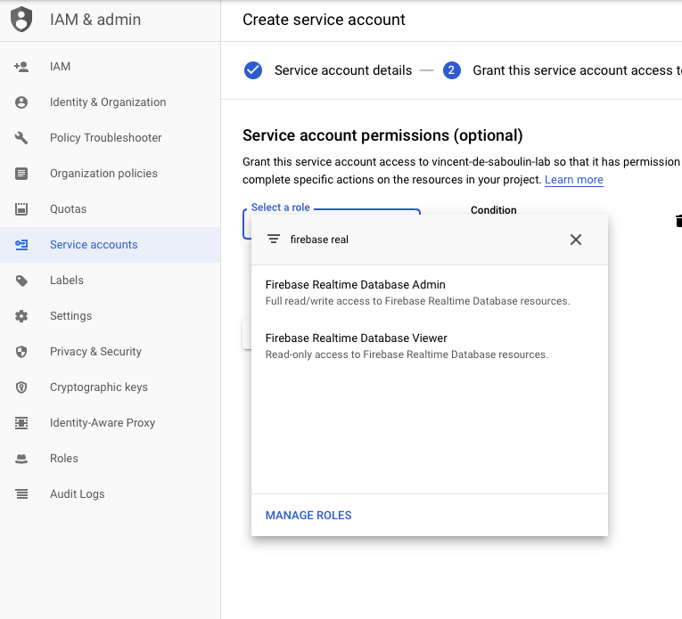
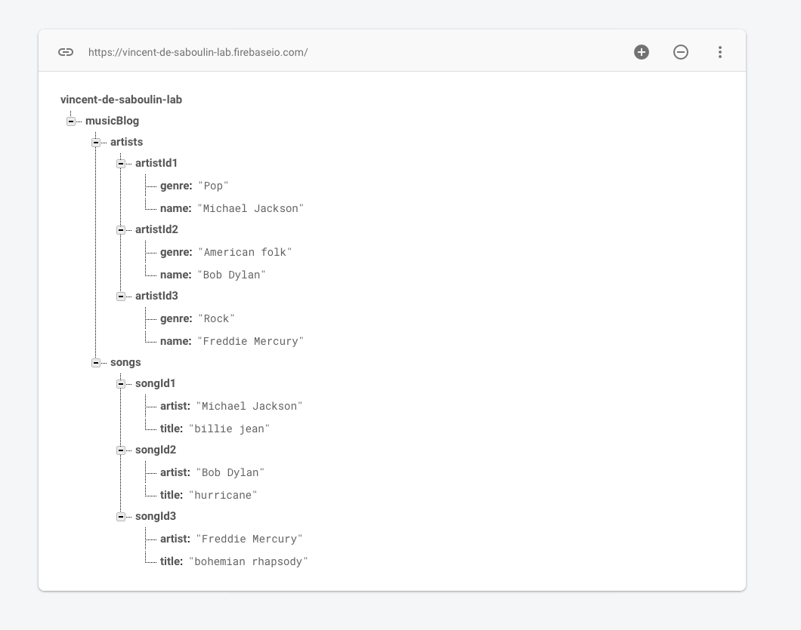

# GCP Firebase Sink connector (using Confluent Cloud)

## Objective

Quickly test [GCP Firebase Sink](https://docs.confluent.io/current/connect/kafka-connect-firebase/sink/index.html#quick-start) connector.


* Active Google Cloud Platform (GCP) account with authorization to create resources

## GCP Firebase Setup

### Service Account setup

Create `Service Account` from IAM & Admin console:

Set `Service account name`:


Choose permission `Firebase`->`Firebase Realtime Database Admin`



Create Key:


Download it as JSON:


Rename it to `keyfile.json` and place it in `./keyfile.json`

### Realtime Database setup

Go to [Firebase console](https://console.firebase.google.com), click `Add Project` and choose your GCP project.

In your console, click `Database`on the left sidebar:


Click on `Realtime Database`:


Click on `Enable`:


## How to run

Create `$HOME/.ccloud/config`

On the host from which you are running Docker, ensure that you have properly initialized Confluent Cloud CLI and have a valid configuration file at `$HOME/.ccloud/config`.

Example:

```bash
$ cat $HOME/.ccloud/config
bootstrap.servers=<BROKER ENDPOINT>
ssl.endpoint.identification.algorithm=https
security.protocol=SASL_SSL
sasl.mechanism=PLAIN
sasl.jaas.config=org.apache.kafka.common.security.plain.PlainLoginModule required username\="<API KEY>" password\="<API SECRET>";

// Schema Registry specific settings
basic.auth.credentials.source=USER_INFO
schema.registry.basic.auth.user.info=<SR_API_KEY>:<SR_API_SECRET>
schema.registry.url=<SR ENDPOINT>

// license
confluent.license=<YOUR LICENSE>

// ccloud login password
ccloud.user=<ccloud login>
ccloud.password=<ccloud password>
```

Simply run:

```bash
$ ./gcp-firebase-source.sh <PROJECT>
```

### Verify data has been pushed to Firebase

Go to [Firebase console](https://console.firebase.google.com) and choose your GCP project.

In your console, click `Database`on the left sidebar:


Click on `Realtime Database`:


You should see:



## Details of what the script is doing


Creating GCP Firebase Sink connector

```bash
$ curl -X PUT \
     -H "Content-Type: application/json" \
     --data '{
               "connector.class" : "io.confluent.connect.firebase.FirebaseSinkConnector",
                    "tasks.max" : "1",
                    "topics":"artists,songs",
                    "gcp.firebase.credentials.path": "/root/keyfiles/keyfile.json",
                    "gcp.firebase.database.reference": "https://'"$PROJECT"'.firebaseio.com/musicBlog",
                    "insert.mode":"update",
                    "key.converter" : "io.confluent.connect.avro.AvroConverter",
                    "key.converter.schema.registry.url": "'"$SCHEMA_REGISTRY_URL"'",
                    "key.converter.basic.auth.user.info": "'"$SCHEMA_REGISTRY_BASIC_AUTH_USER_INFO"'",
                    "key.converter.basic.auth.credentials.source": "USER_INFO",
                    "value.converter" : "io.confluent.connect.avro.AvroConverter",
                    "value.converter.schema.registry.url": "'"$SCHEMA_REGISTRY_URL"'",
                    "value.converter.basic.auth.user.info": "'"$SCHEMA_REGISTRY_BASIC_AUTH_USER_INFO"'",
                    "value.converter.basic.auth.credentials.source": "USER_INFO",
                    "confluent.topic.ssl.endpoint.identification.algorithm" : "https",
                    "confluent.topic.sasl.mechanism" : "PLAIN",
                    "confluent.topic.bootstrap.servers": "'"$BOOTSTRAP_SERVERS"'",
                    "confluent.topic.sasl.jaas.config" : "org.apache.kafka.common.security.plain.PlainLoginModule required username=\"'$CLOUD_KEY'\" password=\"'$CLOUD_SECRET'\";",
                    "confluent.topic.security.protocol" : "SASL_SSL",
                    "confluent.topic.replication.factor": "3"
          }' \
     http://localhost:8083/connectors/firebase-sink/config | jq .
```

Produce Avro data to topic artists

```bash
$ docker exec -i -e BOOTSTRAP_SERVERS="$BOOTSTRAP_SERVERS" -e SASL_JAAS_CONFIG="$SASL_JAAS_CONFIG" -e SCHEMA_REGISTRY_BASIC_AUTH_USER_INFO="$SCHEMA_REGISTRY_BASIC_AUTH_USER_INFO" -e SCHEMA_REGISTRY_URL="$SCHEMA_REGISTRY_URL" connect kafka-avro-console-producer --broker-list $BOOTSTRAP_SERVERS --producer-property ssl.endpoint.identification.algorithm=https --producer-property sasl.mechanism=PLAIN --producer-property security.protocol=SASL_SSL --producer-property sasl.jaas.config="$SASL_JAAS_CONFIG" --property basic.auth.credentials.source=USER_INFO --property schema.registry.basic.auth.user.info="$SCHEMA_REGISTRY_BASIC_AUTH_USER_INFO" --property schema.registry.url=$SCHEMA_REGISTRY_URL --topic artists --property parse.key=true --property key.schema='{"type":"string"}' --property "key.separator=:" --property value.schema='{"type":"record","name":"artists","fields":[{"name":"name","type":"string"},{"name":"genre","type":"string"}]}' << EOF
"artistId1":{"name":"Michael Jackson","genre":"Pop"}
"artistId2":{"name":"Bob Dylan","genre":"American folk"}
"artistId3":{"name":"Freddie Mercury","genre":"Rock"}
"artistId4":{"name":"Vincent McMorrow","genre":"Other"}
EOF

```

Produce Avro data to topic songs

```bash
$ docker exec -i -e BOOTSTRAP_SERVERS="$BOOTSTRAP_SERVERS" -e SASL_JAAS_CONFIG="$SASL_JAAS_CONFIG" -e SCHEMA_REGISTRY_BASIC_AUTH_USER_INFO="$SCHEMA_REGISTRY_BASIC_AUTH_USER_INFO" -e SCHEMA_REGISTRY_URL="$SCHEMA_REGISTRY_URL" connect kafka-avro-console-producer --broker-list $BOOTSTRAP_SERVERS --producer-property ssl.endpoint.identification.algorithm=https --producer-property sasl.mechanism=PLAIN --producer-property security.protocol=SASL_SSL --producer-property sasl.jaas.config="$SASL_JAAS_CONFIG" --property basic.auth.credentials.source=USER_INFO --property schema.registry.basic.auth.user.info="$SCHEMA_REGISTRY_BASIC_AUTH_USER_INFO" --property schema.registry.url=$SCHEMA_REGISTRY_URL --topic songs --property parse.key=true --property key.schema='{"type":"string"}' --property "key.separator=:" --property value.schema='{"type":"record","name":"songs","fields":[{"name":"title","type":"string"},{"name":"artist","type":"string"}]}' << EOF
"songId1":{"title":"billie jean","artist":"Michael Jackson"}
"songId2":{"title":"hurricane","artist":"Bob Dylan"}
"songId3":{"title":"bohemian rhapsody","artist":"Freddie Mercury"}
EOF
```

[Verify data has been pushed to Firebase](#verify-data-has-been-pushed-to-firebase)

N.B: Control Center is reachable at [http://127.0.0.1:9021](http://127.0.0.1:9021])
